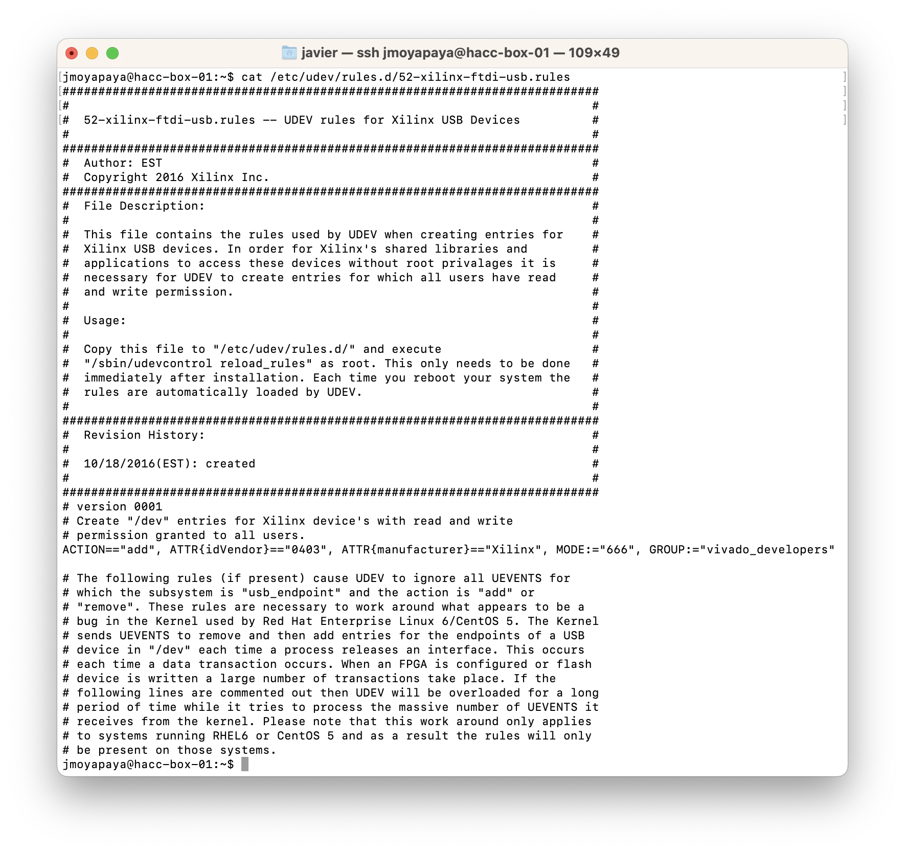
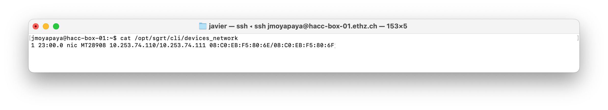
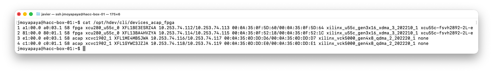
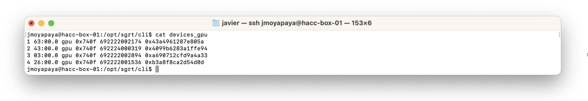
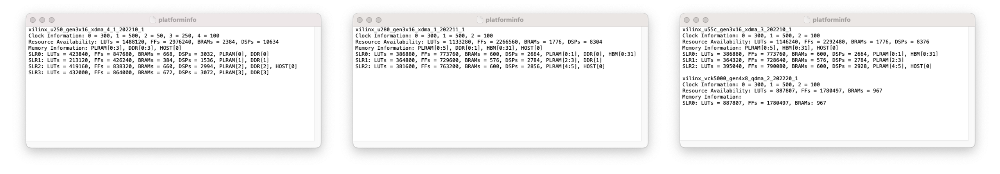
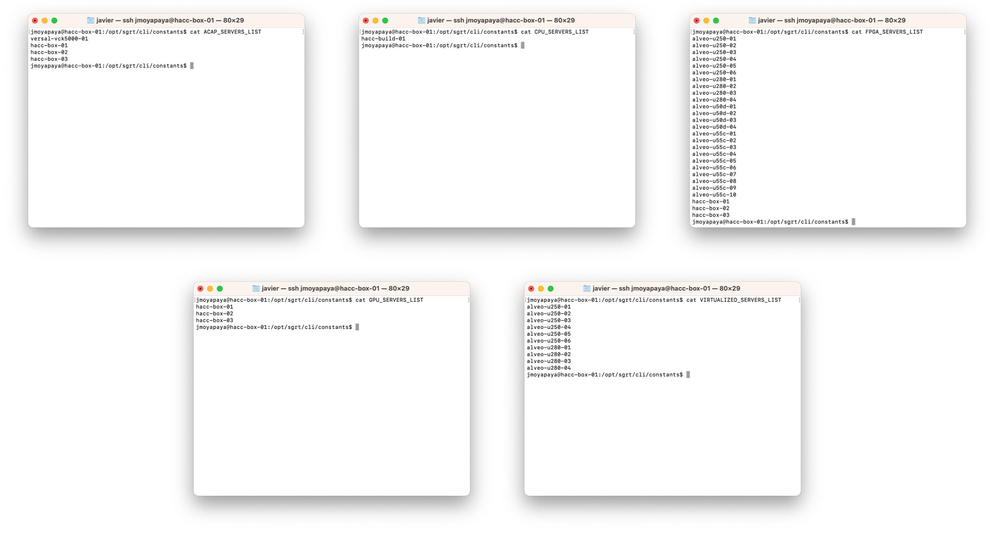

<div id="readme" class="Box-body readme blob js-code-block-container">
<article class="markdown-body entry-content p-3 p-md-6" itemprop="text">
<p align="right">
<a href="https://github.com/fpgasystems/hdev?tab=readme-ov-file#--hacc-development">Back to top</a>
</p>

# Installation

To install **[hdev,](https://github.com/fpgasystems/hdev)** please proceed by following these steps:

* [Downloading the installer](#downloading-the-installer)
* [Running the installer](#running-the-installer)
* [Installing prerequisite software](#installing-prerequisite-software)
* [System and Vivado configuration](#system-and-vivado-configuration)
* [Generating device configuration files](#generating-device-configuration-files)
* [Generating device information files](#generating-device-information-files)
* [Enabling hdev on a cluster](#enabling-hdev-on-a-cluster)

## Downloading the installer
```
git clone https://github.com/fpgasystems/sgrt_install.git
```

## Running the installer
Before running the installer, please ensure the following **prerrequisites:**

* The user executing the installer possesses sudo capabilities.
* Confirm the existence of the ```/tmp``` folder on the targeted server, and ensure that both ```$USER``` and root have write permissions on it.

Once these prerequisites are confirmed, proceed with the installation:

```
sudo ./sgrt_install/run.sh
```

The first thing you need to do after running the installer is to provide a **non-existing path where you want to install hdev.** For example, designating ```/opt``` will install **hdev** in ```/opt/hdev```. 

After that, the installer will cotinue asking server-related and tool path questions. The following information is intended to assist you in making the correct **path selections:**

<!-- There are 14 - SERVER_LIST = 14 - 4 = 10 variables with dialogs as in run.sh -->
* **AVED_PATH:** This parameter designates the path to the valid AVED (Alveo Versal Example Design) xbtest installation, installed by default at ```/opt/amd/aved```.
* **AVED_TOOLS_PATH:** This field specifies the path to the command line tool for the AMI driver API (ami_tool) installed on the server. The default value is established as ```/usr/local/bin```.
* **LOCAL_PATH:** This parameter designates a directory where the user (```$USER```) must have the required privileges to conduct read, write, and application execution operations. By default, this path is configured as ```/local/home/$USER```.
* **MY_DRIVERS_PATH:** This parameter specifies a directory where the user (```$USER```) should possess the necessary permissions to employ the ```rmmod``` and ```insmod``` system calls. By default, this path is configured as ```/tmp/devices_acap_fpga_drivers``` (where inserted driver files would be removed after a server reboot).
* **MY_PROJECTS_PATH:** This parameter designates a directory where the user (```$USER```) must have the required privileges to conduct read, write, and application execution operations. The default setting is ```/home/$USER/my_projects```, where ```/home/$USER``` typically corresponds to an NFS hard drive accessible from all servers within a cluster.
* **GITHUB_CLI_PATH:** This field specifies the path to a valid GitHub CLI installation, with the default location set at ```/usr/bin```.
* **ROCM_PATH:** This field specifies the path to a valid ROCm installation, with the default location set at ```/opt/rocm```.
* **UPDATES_PATH:** This parameter designates a directory where sudo users have the required privileges to conduct read, write, and application execution operations. By default, this path is configured as ```/tmp```.
* **XILINX_PLATFORMS_PATH:** This parameter designates the path to the Xilinx platforms installed on the server. The default value is configured as ```/opt/xilinx/platforms```.
* **XILINX_TOOLS_PATH:** This field specifies the path to the Xilinx tools (Vivado, Vitis, Vitis_HLS) installed on the server. The default value is established as ```/tools/Xilinx/```.
* **XILINXD_LICENSE_FILE:** A list of verified license servers for Xilinx tools.
* **XRT_PATH:** This parameter designates the path to a valid Xilinx RunTime installation, with the default setting positioned at ```/opt/xilinx/xrt```.

Please note that you have the flexibility to utilize any other environment variable distinct from ```$USER``` to define your paths.

## Installing prerequisite software

To ensure proper functionality, the following tools must be present on the server for **hdev** to run:

### Xilinx tools and deployment target platforms
For those servers with reconfigurable devices, the following criteria apply:

* **XRT (Xilinx RunTime):** To ensure proper operation, a valid XRT version must be present in the designated ```XRT_PATH```. 
* **Vivado and Vitis_HLS:**  In order to run **hdev** effectively, it is mandatory to have valid versions of Vivado and Vitis_HLS installed within the specified ```XILINX_TOOLS_PATH```.
* **Vitis:** The inclusion of the Vitis Development Core is optional but can be beneficial. If you choose to install it, please ensure that it is also placed within the ```XILINX_TOOLS_PATH``` directory for seamless integration.

Finally, as a vital requirement, all the Xilinx accelerator cards mounted on the deployment server must have their **deployment target platform toolkit** available within the designated ```XILINX_PLATFORMS_PATH``` directory.

### HIP and ROCm tools
For servers equipped with GPUs, a valid HIP/ROCm release must be present in the designated ```ROCM_PATH``` directory.

### Other tools
Besides the tools listed above, the following are also required to make **hdev** fully operative: <!-- This should match the PACKAGES vector in run.sh -->

* curl
* [GitHub CLI](https://cli.github.com) 
* jq
* python3
* uncrustify
<!-- * iperf
* [MPICH](https://www.mpich.org) -->

## System and Vivado configuration

The user groups **all_users** and **vivado_developers** should be added to ```/etc/sudoers.d```:

```
ALL ALL=NOPASSWD:$CLI_PATH/common/get_booking_system_servers_list,$CLI_PATH/program/vitis,$CLI_PATH/program/revert
```
*all_users group contents.*

```
vivado_developers ALL=(ALL) NOPASSWD:/sbin/reboot,/sbin/insmod,/sbin/rmmod,/sbin/iptables,$CLI_PATH/program/fpga_chmod,$CLI_PATH/program/pci_hot_plug,$CLI_PATH/program/vivado,$CLI_PATH/program/rescan,/usr/sbin/modprobe,$CLI_PATH/set/write
```
*vivado_developer group contents.*

where ```$CLI_PATH``` represents **hdev** CLI path, for example ```/opt/hdev/cli``` and **must be declared as environmental varible.**

### Vivado configuration
In order to use the **Vivado workflow, hedv** requires to **install cable drivers** for Xilinx boards and **configure udev rules.**

1. **Install cable drivers:** 
```
cd $XILINX_VIVADO/data/xicom/cable_drivers/lin64/install_script/install_drivers/
./install_drivers
```
where ```$XILINX_VIVADO``` is an environment variable related to ```XILINX_TOOLS_PATH```.

2. **Configure udev rules:** 
```
sudo sed -i '/^ACTION=="add", ATTR{idVendor}=="0403", ATTR{manufacturer}=="Xilinx"/c ACTION=="add", ATTR{idVendor}=="0403", ATTR{manufacturer}=="Xilinx", MODE:="666", GROUP:="vivado_developers"' /etc/udev/rules.d/52-xilinx-ftdi-usb.rules
```
where the **vivado_developers** group relates to the section above.


*Installing cable drivers and configuring udev rules.*

## Generating device configuration files

An essential **hdev** component are the device configuration files. Each server running **hdev** requires three files: one for networking devices, one for adaptable devices (ACAPs, ASoCs and FPGAs) and another for GPUs. These files are assumed to be correct, and what follows helps you generate them accurately.

### devices_network
A **devices_network** configuration file is located in ```$CLI_PATH/devices_network``` and looks like this:


*devices_network.*

There is one row per networking device, and the columns represent the following information:

1. **Device Index:** An autogenerated integer value, starting from 1.
2. **BDF:** Identify the Bus Device Function (BDF) of your networking device using the ```lspci | grep Ethernet``` command. For NICs with multiple ports, capture only the function zero (e.g., 23:00.0).
3. **Device Type:** Must be set to "nic."
4. **Device Name:** A representative string that identifies the vendor or model of your NIC.
5. **IP Addresses:** Assign an IP address to each NIC port based on your networking configuration plan.
6. **MAC Addresses:** Assign a MAC address to each NIC port based on your networking configuration plan.

### devices_acap_fpga
A **devices_acap_fpga** configuration file is located in ```$CLI_PATH/devices_acap_fpga``` and looks like this:


*devices_acap_fpga.*

There is one row per reconfigurable device, and the columns represent the following information:

1. **Device Index:** An autogenerated integer value, starting from 1.
2. **Upstream Port:** Identify Xilinx reconfigurable devices' *upstream ports* using the command: ```lspci | grep Xilinx | grep '\.0 '``` (e.g., ```a1:00.0```).
3. **Root Port:** Find the root port related to the upstream port using: ```sudo lspci -t``` (e.g., ```a1:00.0``` corresponds to ```a0:03.1```).
4. **LnkCtl:** Discover *LnkCtl* capabilities related to the root port using: ```sudo lspci -vvv -s``` (e.g., ```sudo lspci -vvv -s a0:03.1``` corresponds to ```58```).
5. **Device Type:** Select between "acap", "asoc", or "fpga" based on the Platform’s XSA Name revealed by the ```xbutil examine``` command.
6. **Device Name:** The device name can be found in the Vivado GUI when you open the hardware target of interest, e.g., ```xcu280_u55c_0```.
7. **Serial Number:** Obtain the *serial number* of the device of interest using the ```sudo xbmgmt examine``` command.
8. **IP Addresses:** Assign two IP addresses (one for each QSFP interface, separated by a slash) according to your IP configuration plan.
9. **MAC Addresses:** Retrieve the *MAC addresses* corresponding to the IP addresses above for the device of interest using the ```xbutil examine``` command.
10. **Platform:** Determine the platform of the device of interest using the ```xbutil examine``` command.

 and device name (step 6).")
*Getting root port (step 3) and device name (step 6).*

### devices_gpu
A **devices_gpu** configuration file is located in ```$CLI_PATH/devices_gpu``` and looks like this:


*devices_gpu.*

As before, there is one row per GPU, and the columns represent the following information:

1. **Device Index:** An autogenerated integer value, starting from 1.
2. **Bus:** Determine the *bus* value using the ```rocm-smi --showbus``` command.
3. **Device Type:** Set to "gpu."
4. **GPU ID:** Obtain the *GPU ID* using the ```rocm-smi -i``` command.
5. **Serial Number:** Find the *serial number* using the ```rocm-smi --showserial``` command.
6. **Unique ID:** Retrieve the *unique ID* using the ```rocm-smi --showuniqueid``` command.

## Generating device information files

Alongside the device configuration files, each server running **hdev** requires the ```$CLI_PATH/platforminfo``` file, which contains pertinent details about clock speed, available resources, and memory. The Xilinx tool ```platforminfo``` can assist in obtaining the appropriate values for these files.


*platforminfo for three different servers: one mounting an Alveo U250 board, one mounting a U280 board, and one mounting one U55C and one Versal VCK5000.*

## Enabling hdev on a cluster
Under the following assumptions, **hdev** can program bitstreams on remote servers’ ACAPs and FPGAs:

1. **hdev** is successfully installed on all the servers you wish to include in your managed cluster.
2. The remote servers are on the same IP network.
3. You have the necessary SSH access permissions to interact with the remote servers.
4. All target servers have replicated copies of the five SERVERS_LIST files, which are located in the ```$CLI_PATH/constants``` directory. **To illustrate, here's an example of such files in a real hdev cluster:**


*The files ACAP_SERVERS_LIST, BUILD_SERVERS_LIST, FPGA_SERVERS_LIST, GPU_SERVERS_LIST, and VIRTUALIZED_SERVERS_LIST are replicated on all servers in the cluster.*

For larger clusters with a significant amount of servers, consider using infrastrcture automation platforms for [System and Vivado configuration](#system-and-vivado-configuration) and [Generating device configuration files](#generating-device-configuration-files). As mentioned in [Operating the cluster](https://github.com/fpgasystems/hacc/blob/main/docs/operating-the-cluster.md#operating-the-cluster), ETHZ-HACC is using Ansible.

<!-- # License

[](https://opensource.org/licenses/MIT)

Copyright (c) 2023 FPGA @ Systems Group, ETH Zurich

Permission is hereby granted, free of charge, to any person obtaining a copy
of this software and associated documentation files (the "Software"), to deal
in the Software without restriction, including without limitation the rights
to use, copy, modify, merge, publish, distribute, sublicense, and/or sell
copies of the Software, and to permit persons to whom the Software is
furnished to do so, subject to the following conditions:

The above copyright notice and this permission notice shall be included in all
copies or substantial portions of the Software.

THE SOFTWARE IS PROVIDED "AS IS", WITHOUT WARRANTY OF ANY KIND, EXPRESS OR
IMPLIED, INCLUDING BUT NOT LIMITED TO THE WARRANTIES OF MERCHANTABILITY,
FITNESS FOR A PARTICULAR PURPOSE AND NONINFRINGEMENT. IN NO EVENT SHALL THE
AUTHORS OR COPYRIGHT HOLDERS BE LIABLE FOR ANY CLAIM, DAMAGES OR OTHER
LIABILITY, WHETHER IN AN ACTION OF CONTRACT, TORT OR OTHERWISE, ARISING FROM,
OUT OF OR IN CONNECTION WITH THE SOFTWARE OR THE USE OR OTHER DEALINGS IN THE
SOFTWARE. -->